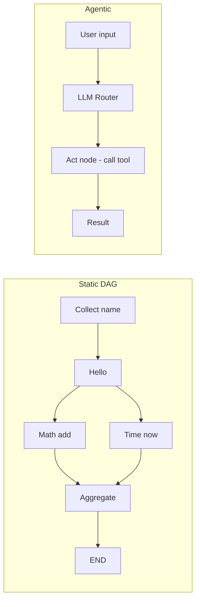

```mermaid
flowchart LR
    subgraph Static DAG
        A[Collect name] --> B[Hello]
        B --> C[Math add]
        B --> D[Time now]
        C --> E[Aggregate]
        D --> E
        E --> F[END]
    end

    subgraph Agentic
        U[User input] --> R[LLM Router]
        R --> Act[Act node - call tool]
        Act --> F2[Result]
    end
```
