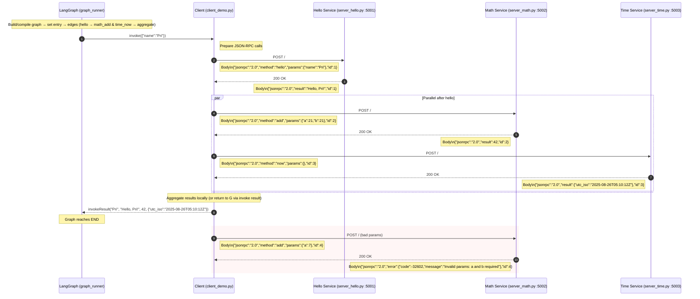

```mermaid
sequenceDiagram
    autonumber
    participant G as LangGraph (graph_runner)
    participant C as Client (client_demo.py)
    participant H as Hello Service (server_hello.py :5001)
    participant M as Math Service (server_math.py :5002)
    participant T as Time Service (server_time.py :5003)

    Note over G: Build/compile graph → set entry → edges (hello → math_add & time_now → aggregate)

    G->>C: invoke({"name":"Pri"})
    Note right of C: Prepare JSON-RPC calls

    %% --- Hello ---
    C->>H: POST /
    Note right of C: Body\n{"jsonrpc":"2.0","method":"hello","params":{"name":"Pri"},"id":1}
    H-->>C: 200 OK
    Note left of H: Body\n{"jsonrpc":"2.0","result":"Hello, Pri!","id":1}

    %% --- Math: add ---
    par Parallel after hello
        C->>M: POST /
        Note right of C: Body\n{"jsonrpc":"2.0","method":"add","params":{"a":21,"b":21},"id":2}
        M-->>C: 200 OK
        Note left of M: Body\n{"jsonrpc":"2.0","result":42,"id":2}

        %% --- Time: now ---
        C->>T: POST /
        Note right of C: Body\n{"jsonrpc":"2.0","method":"now","params":{},"id":3}
        T-->>C: 200 OK
        Note left of T: Body\n{"jsonrpc":"2.0","result":{"utc_iso":"2025-08-26T05:10:12Z"},"id":3}
    and
    end

    Note over C: Aggregate results locally (or return to G via invoke result)

    C-->>G: invokeResult("Pri", "Hello, Pri!", 42, {"utc_iso":"2025-08-26T05:10:12Z"})

    Note over G: Graph reaches END

    %% --- Optional error examples ---
    rect rgba(255, 240, 240, 0.6)
    C->>M: POST / (bad params)
    Note right of C: Body\n{"jsonrpc":"2.0","method":"add","params":{"a":7},"id":4}
    M-->>C: 200 OK
    Note left of M: Body\n{"jsonrpc":"2.0","error":{"code":-32602,"message":"Invalid params: a and b required"},"id":4}
    end
```
